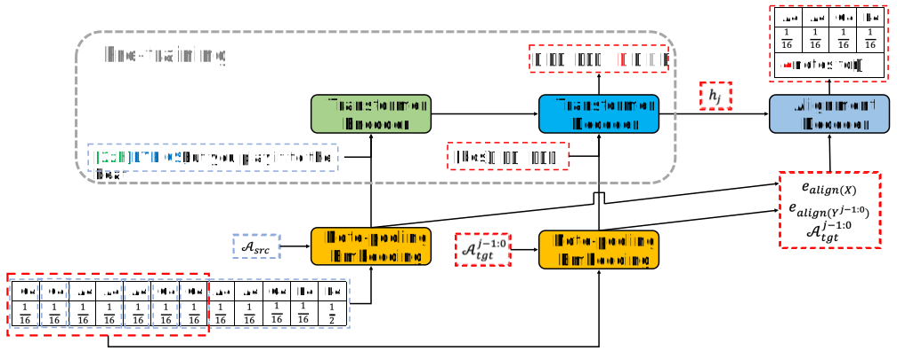
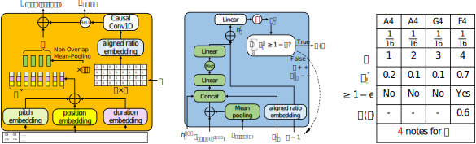

# Translate the Beauty in Songs: Jointly Learning to Align Melody and Translate Lyrics

Under Review
ACL 2023 ARR October Submission

## Abstract

Song translation requires both translation of lyrics and alignment of music notes so that the resulting verse can be sung to the accompanying melody, which is a challenging problem that has attracted some interests in different aspects of the translation process. In this paper, we propose <u>L</u>yrics-Melody <u>T</u>ranslation with <u>A</u>daptive <u>G</u>rouping (LTAG), a holistic solution to automatic song translation by jointly modeling lyrics translation and lyrics-melody alignment. It is a novel encoder-decoder framework that can simultaneously translate the source lyrics and determine the number of aligned notes at each decoding step through an adaptive note grouping module. To address data scarcity, we commissioned a small amount of training data annotated specifically for this task and used large amounts of augmented data through back-translation. Experiments conducted on an English-Chinese song translation data set show the effectiveness of our model in both automatic and human evaluations.

## Translated Scores and Sythesized Singing Audio Samples
### En -> Zh

0. "Is love I can be sure of" from *"Will You Still Love Me Tomorrow"*

<table style='width: 200%;'>
    <thead>
    <tr>
        <th></th>
        <th>Source and Reference</th>
        <th>GagaST</th>
        <th>LTAG-cls</th>
        <th>LTAG</th>
    </tr>
    </thead>
    <tbody>
    <tr style="height: 50%;">
        <th scope="row">lyrics text</th>
        <td>en:is love I can be sure of zh:是否能给我安全感 shì fǒu néng gěi wǒ ān quán gǎn</td>
        <td>this is &nbsp;&nbsp;love I&nbsp; can&nbsp; be sure of love 这 &nbsp;&nbsp;就是 爱， 我 可以 肯定的 &nbsp;&nbsp;&nbsp;&nbsp;爱吗 zhè jiù shì ài，wǒ kě yǐ kěn dìng de ài ma</td>
        <td>is love I&nbsp; can be sure of 是 爱&nbsp;&nbsp; 我 能&nbsp; 确定 shì ài wǒ néng kěn dìng</td>
        <td>is love   I&nbsp; can&nbsp; be sure of 是 爱&nbsp;&nbsp; 我 可以 肯定 shì ài wǒ kě yǐ kěn dìng</td>
    </tr>
    <tr style="height: 400%;">
        <th scope="row">scores</th>
        <td></td>
        <td></td>
        <td></td>
        <td></td>
    </tr>
    <tr style="height: 50%;">
        <th scope="row">wav</th>
        <td><audio controls="" ><source src="resources/audio/en_zh/gt/0.wav" type="audio/wav"></audio></td>
        <td><audio controls="" ><source src="resources/audio/en_zh/gagast/0.wav" type="audio/wav"></audio></td>
        <td><audio controls="" ><source src="resources/audio/en_zh/baseline/0.wav" type="audio/wav"></audio></td>
        <td><audio controls="" ><source src="resources/audio/en_zh/ltag/0.wav" type="audio/wav"></audio></td>
    </tr>
    </tbody>
</table>

1. "I need you here I need you here to wipe away my tears" from *"Run To You"*

<table style='width: 200%;'>
    <thead>
    <tr>
        <th></th>
        <th>Source and Reference</th>
        <th>GagaST</th>
        <th>LTAG-cls</th>
        <th>LTAG</th>
    </tr>
    </thead>
    <tbody>
    <tr style="height: 50%;">
        <th scope="row">lyrics text</th>
        <td>en:I need you here I need you here to wipe away my tears zh:我需要你 我需要你帮我抹去泪水 wǒ xū yào nǐ wǒ xū yào nǐ bāng wǒ mǒ qù lèi shuǐ</td>
        <td>I&nbsp;   need   you   I&nbsp;   need   you   here&nbsp;&nbsp;   to   wipe   tears 我 需要 你&nbsp; 我 需要 你&nbsp; 在这里 来 擦去 眼泪 wǒ xū yào nǐ wǒ xū yào nǐ zài zhè lǐ cā qù yǎn lèi</td>
        <td>I&nbsp;   need   you   I&nbsp;   need   you   wipe   tears 我 需要 你&nbsp; 我 需要 你&nbsp; 擦干 眼泪 wǒ xū yào nǐ wǒ xū yào nǐ cā gān yǎn lèi</td>
        <td>I&nbsp;   need   you   I&nbsp;   need   you   wipe   tears 我 需要 你&nbsp; 我 需要 你&nbsp; 擦干 眼泪 wǒ xū yào nǐ wǒ xū yào nǐ cā gān lèi shǔi</td>
    </tr>
    <tr style="height: 400%;">
        <th scope="row">scores</th>
        <td></td>
        <td></td>
        <td></td>
        <td></td>
    </tr>
    <tr style="height: 50%;">
        <th scope="row">wav</th>
        <td><audio controls="" ><source src="resources/audio/en_zh/gt/1.wav" type="audio/wav"></audio></td>
        <td><audio controls="" ><source src="resources/audio/en_zh/gagast/1.wav" type="audio/wav"></audio></td>
        <td><audio controls="" ><source src="resources/audio/en_zh/baseline/1.wav" type="audio/wav"></audio></td>
        <td><audio controls="" ><source src="resources/audio/en_zh/ltag/1.wav" type="audio/wav"></audio></td>
    </tr>
    </tbody>
</table>

2. "Aint nothing but a heartache Tell Me Why Aint nothing but a mistake" from *"I Want It That Way"*

<table style='width: 200%;'>
    <thead>
    <tr>
        <th></th>
        <th>Source and Reference</th>
        <th>GagaST</th>
        <th>LTAG-cls</th>
        <th>LTAG</th>
    </tr>
    </thead>
    <tbody>
    <tr style="height: 50%;">
        <th scope="row">lyrics text</th>
        <td>en:Aint nothing but a heartache Tell Me Why Aint nothing but a mistake zh:为什么让我心痛 告诉我 为什么你不行动 wèi shén mè ràng wǒ xīn tòng gào sù wǒ wèi shén mè nǐ bù xíng dòng</td>
        <td>aint nothing    a heartache   but&nbsp;  tell   me   aint nothing  a&nbsp;   mistake 不过是&nbsp;&nbsp;&nbsp;&nbsp;&nbsp;&nbsp; 心痛&nbsp;&nbsp;&nbsp;&nbsp;&nbsp;&nbsp;&nbsp; 而已 告诉 我 只不过是&nbsp;&nbsp;&nbsp;&nbsp; 个 错误 bú guò shì xīn tòng ér yǐ gào sù wǒ zhǐ bú guò shì gè cuò wu</td>
        <td>aint nothing    a heartache   tell   me   aint nothing but   a&nbsp;   mistake 不过是&nbsp;&nbsp;&nbsp;&nbsp;&nbsp;&nbsp; 心痛&nbsp;&nbsp;&nbsp;&nbsp;&nbsp;&nbsp;&nbsp; 告诉 我 不过是&nbsp;&nbsp;&nbsp;&nbsp;&nbsp;&nbsp; 个 错 bú guò shì xīn tòng gào sù wǒ bú guò shì gè cuò</td>
        <td>aint nothing    but&nbsp;   a heartache   tell   me   aint nothing&nbsp;&nbsp;&nbsp;&nbsp;&nbsp;&nbsp;   but&nbsp;   a&nbsp;   mistake 没什么&nbsp;&nbsp;&nbsp;&nbsp;&nbsp;&nbsp; 只是 心痛&nbsp;&nbsp;&nbsp;&nbsp;&nbsp;&nbsp;&nbsp; 告诉 我 没什么 只是 个 错 méi shén mè zhǐ shì xīn tòng gào sù wǒ méi shén mè zhǐ shì gè cuò</td>
    </tr>
    <tr style="height: 400%;">
        <th scope="row">scores</th>
        <td></td>
        <td></td>
        <td></td>
        <td></td>
    </tr>
    <tr style="height: 50%;">
        <th scope="row">wav</th>
        <td><audio controls="" ><source src="resources/audio/en_zh/gt/2.wav" type="audio/wav"></audio></td>
        <td><audio controls="" ><source src="resources/audio/en_zh/gagast/2.wav" type="audio/wav"></audio></td>
        <td><audio controls="" ><source src="resources/audio/en_zh/baseline/2.wav" type="audio/wav"></audio></td>
        <td><audio controls="" ><source src="resources/audio/en_zh/ltag/2.wav" type="audio/wav"></audio></td>
    </tr>
    </tbody>
</table>

3. "And I'm thinking about how people fall in love in mysterious ways Maybe just the touch of a hand" from *"Thinking Out Load"*

<table style='width: 200%;'>
    <thead>
    <tr>
        <th></th>
        <th>Source and Reference</th>
        <th>GagaST</th>
        <th>LTAG-cls</th>
        <th>LTAG</th>
    </tr>
    </thead>
    <tbody>
    <tr style="height: 50%;">
        <th scope="row">lyrics text</th>
        <td>en:And I'm thinking about how people fall in love in mysterious ways Maybe just the touch of a hand zh:我一直在想人们如何神秘地坠入爱河 或许只是轻碰了手 wǒ yì zhí zài xiǎng rén men rú hé shén mì de zhuì rù ài hé huò xǔ zhǐ shì qīng pèng le shǒu</td>
        <td>And&nbsp;   I'm   thinking about   people   how&nbsp;&nbsp;&nbsp;   in mysterious ways  fall in   love   Maybe   just&nbsp;&nbsp;   a hand 而且 我&nbsp; 在想着&nbsp;&nbsp;&nbsp;&nbsp;&nbsp;&nbsp;&nbsp;&nbsp; 人们&nbsp;&nbsp; 是如何 以神秘的方式&nbsp;&nbsp;&nbsp;&nbsp;&nbsp;&nbsp; 坠入&nbsp;&nbsp;&nbsp; 爱河 也许&nbsp; 仅仅是 一只手 ér qǐe wǒ zài xiǎng zhe rén men shì rú hé yǐ shén mì de fāng shì zhuì rù ài hé yě xǔ jǐn jǐn shì yì zhī shǒu</td>
        <td>I'm   thinking about   people   how&nbsp;&nbsp;&nbsp;   in mysterious ways  fall in&nbsp;&nbsp;   Maybe   just   the touch of a hand 我&nbsp; 在想&nbsp;&nbsp;&nbsp;&nbsp;&nbsp;&nbsp;&nbsp;&nbsp;&nbsp;&nbsp; 人们&nbsp;&nbsp; 是如何 神秘地&nbsp;&nbsp;&nbsp;&nbsp;&nbsp;&nbsp;&nbsp;&nbsp;&nbsp;&nbsp;&nbsp;&nbsp; 坠落 也许&nbsp; 只是 一触即发 wǒ zài xiǎng rén men shì rú hé shén mì de zhuì luò yě xǔ zhǐ shì yì chù jí fā</td>
        <td>I'm   thinking about   people   how&nbsp;   in mysterious ways  fall in   love   Maybe   just   the touch of a hand 我&nbsp; 在想&nbsp;&nbsp;&nbsp;&nbsp;&nbsp;&nbsp;&nbsp;&nbsp;&nbsp;&nbsp; 人们&nbsp;&nbsp; 如何 神秘地&nbsp;&nbsp;&nbsp;&nbsp;&nbsp;&nbsp;&nbsp;&nbsp;&nbsp;&nbsp;&nbsp;&nbsp; 坠入&nbsp;&nbsp;&nbsp; 爱河 也许&nbsp; 只是 一触即发 wǒ zài xiǎng rén men rú hé shén mì de zhuì rù ài hé yě xǔ zhǐ shì yì chù jí fā</td>
    </tr>
    <tr style="height: 400%;">
        <th scope="row">scores</th>
        <td></td>
        <td></td>
        <td></td>
        <td></td>
    </tr>
    <tr style="height: 50%;">
        <th scope="row">wav</th>
        <td><audio controls="" ><source src="resources/audio/en_zh/gt/3.wav" type="audio/wav"></audio></td>
        <td><audio controls="" ><source src="resources/audio/en_zh/gagast/3.wav" type="audio/wav"></audio></td>
        <td><audio controls="" ><source src="resources/audio/en_zh/baseline/3.wav" type="audio/wav"></audio></td>
        <td><audio controls="" ><source src="resources/audio/en_zh/ltag/3.wav" type="audio/wav"></audio></td>
    </tr>
    </tbody>
</table>

4. "Kiss me under the light of a thousand stars" from *"Thinking Out Load"*

<table style='width: 200%;'>
    <thead>
    <tr>
        <th></th>
        <th>Source and Reference</th>
        <th>GagaST</th>
        <th>LTAG-cls</th>
        <th>LTAG</th>
    </tr>
    </thead>
    <tbody>
    <tr style="height: 50%;">
        <th scope="row">lyrics text</th>
        <td>en:Kiss me under the light of a thousand stars zh:在 星空下 吻 我 吧 </td>
        <td>under   a thousand   stars&nbsp;   the light of   kiss   me 在&nbsp;&nbsp;&nbsp; 成千上万颗 星星的 光下&nbsp;&nbsp;&nbsp;&nbsp;&nbsp;&nbsp;&nbsp;&nbsp; 吻&nbsp;&nbsp; 我 zài chéngß qiān shàng wàn kē xīng xing de guāng xià wěn wǒ</td>
        <td>a thousand stars under the light of  kiss   me 千星&nbsp;&nbsp;&nbsp;&nbsp;&nbsp;&nbsp;&nbsp;&nbsp;&nbsp;&nbsp;&nbsp;&nbsp; 之光下&nbsp;&nbsp;&nbsp;&nbsp;&nbsp;&nbsp;&nbsp;&nbsp;&nbsp;&nbsp;&nbsp;&nbsp; 吻&nbsp;&nbsp; 我 qiān xīng zhī guāng xià wěn wǒ</td>
        <td>under a thousand stars  the light of  kiss   me 在&nbsp;&nbsp;&nbsp; 千星&nbsp;&nbsp;&nbsp;&nbsp;&nbsp;&nbsp;&nbsp;&nbsp;&nbsp;&nbsp;&nbsp;&nbsp; 之光下&nbsp;&nbsp;&nbsp;&nbsp;&nbsp;&nbsp; 吻&nbsp;&nbsp; 我 zài qiān xīng zhī guāng xià wěn wǒ</td>
    </tr>
    <tr style="height: 400%;">
        <th scope="row">scores</th>
        <td></td>
        <td></td>
        <td></td>
        <td></td>
    </tr>
    <tr style="height: 50%;">
        <th scope="row">wav</th>
        <td><audio controls="" ><source src="resources/audio/en_zh/gt/4.wav" type="audio/wav"></audio></td>
        <td><audio controls="" ><source src="resources/audio/en_zh/gagast/4.wav" type="audio/wav"></audio></td>
        <td><audio controls="" ><source src="resources/audio/en_zh/baseline/4.wav" type="audio/wav"></audio></td>
        <td><audio controls="" ><source src="resources/audio/en_zh/ltag/4.wav" type="audio/wav"></audio></td>
    </tr>
    </tbody>
</table>

5. "So full of the superficial Some people want it all But I don't want nothing at all" from *"If I Ain't Got You"*

<table style='width: 200%;'>
    <thead>
    <tr>
        <th></th>
        <th>Source and Reference</th>
        <th>GagaST</th>
        <th>LTAG-cls</th>
        <th>LTAG</th>
    </tr>
    </thead>
    <tbody>
    <tr style="height: 50%;">
        <th scope="row">lyrics text</th>
        <td>en:So full of the superficial Some people want it all But I don't want nothing at all zh:生活实在肤浅至极 有人想拥有一切 而我什么都不缺 shēng huó shí zài fū qiǎn zhì jí yǒu rén xiǎng yōng yǒu yí qiè ér wǒ shén me dōu bù quē</td>
        <td>So&nbsp;&nbsp;   full of   superficial   Some   people   want it   all&nbsp;   But   I&nbsp;   nothing at all   want 如此 充满了&nbsp; 肤浅的&nbsp;&nbsp;&nbsp;&nbsp;&nbsp; 有些 人&nbsp;&nbsp;&nbsp;&nbsp; 想要&nbsp;&nbsp;&nbsp; 一切 但&nbsp; 我 什么也不&nbsp;&nbsp;&nbsp;&nbsp;&nbsp;&nbsp; 想要 rú cǐ chōng mǎn le fū qiǎn de yǒu xiē rén xiǎng yào yí qiè dān wǒ shén me yě bù xiǎng yào</td>
        <td>So full of   superficial   people   all   want it   But   nothing at all 如此的&nbsp;&nbsp;&nbsp;&nbsp; 肤浅&nbsp;&nbsp;&nbsp;&nbsp;&nbsp;&nbsp;&nbsp; 有人&nbsp;&nbsp; 都&nbsp; 想要&nbsp;&nbsp;&nbsp; 却&nbsp; 一无所有 rú cǐ de fū qiǎn yǒu rén dōu xiǎng yào què yī wú suǒ yǒu</td>
        <td>So full of   superficial   Some   people   all   want it   But   nothing at all   want 如此的&nbsp;&nbsp;&nbsp;&nbsp; 肤浅&nbsp;&nbsp;&nbsp;&nbsp;&nbsp;&nbsp;&nbsp; 有些 人&nbsp;&nbsp;&nbsp;&nbsp; 都&nbsp; 想要&nbsp;&nbsp;&nbsp; 却&nbsp; 什么都不&nbsp;&nbsp;&nbsp;&nbsp;&nbsp;&nbsp; 要 rú cǐ de fū qiǎn yǒu xiē rén dōu xiǎng yào què shén me dōu bú yào</td>
    </tr>
    <tr style="height: 400%;">
        <th scope="row">scores</th>
        <td></td>
        <td></td>
        <td></td>
        <td></td>
    </tr>
    <tr style="height: 50%;">
        <th scope="row">wav</th>
        <td><audio controls="" ><source src="resources/audio/en_zh/gt/5.wav" type="audio/wav"></audio></td>
        <td><audio controls="" ><source src="resources/audio/en_zh/gagast/5.wav" type="audio/wav"></audio></td>
        <td><audio controls="" ><source src="resources/audio/en_zh/baseline/5.wav" type="audio/wav"></audio></td>
        <td><audio controls="" ><source src="resources/audio/en_zh/ltag/5.wav" type="audio/wav"></audio></td>
    </tr>
    </tbody>
</table>

6. "When the rain is blowing in your face And the whole world is on your case" from *"Make you feel my love"*

<table style='width: 200%;'>
    <thead>
    <tr>
        <th></th>
        <th>Source and Reference</th>
        <th>GagaST</th>
        <th>LTAG-cls</th>
        <th>LTAG</th>
    </tr>
    </thead>
    <tbody>
    <tr style="height: 50%;">
        <th scope="row">lyrics text</th>
        <td>en:When the rain is blowing in your face And the whole world is on your case zh:当雨吹打在你的脸上 全世界压在你行李箱</td>
        <td>when   the rain   in   your   face   is blowing   the whole   world  is   on   your   case 当&nbsp;&nbsp; 雨水&nbsp;&nbsp;&nbsp;&nbsp; 在 你的 脸上 吹来时&nbsp;&nbsp;&nbsp;&nbsp; 整个&nbsp;&nbsp;&nbsp;&nbsp;&nbsp; 世界&nbsp; 都 在 你的 案子上 dāng yǔ shuǐ zài nǐ de liǎn shàng chuī lái shí zhěng gè shì jiè dōu zài nǐ de àn zi shàng</td>
        <td>when   the rain   is blowing   your   face   the whole   world   is on   your   case 当&nbsp;&nbsp; 雨&nbsp;&nbsp;&nbsp;&nbsp;&nbsp;&nbsp; 打在&nbsp;&nbsp;&nbsp;&nbsp;&nbsp;&nbsp; 你&nbsp;&nbsp; 脸上 全&nbsp;&nbsp;&nbsp;&nbsp;&nbsp;&nbsp;&nbsp; 世界&nbsp; 都在&nbsp; 你&nbsp;&nbsp; 左右 dāng yǔ dǎ zài nǐ liǎn shàng quán shì jiè dōu zài nǐ zuǒ yòu</td>
        <td>when   the rain   is blowing  your   face      the whole   world   is&nbsp;&nbsp;   on your case 当&nbsp;&nbsp; 雨&nbsp;&nbsp;&nbsp;&nbsp;&nbsp;&nbsp; 打在&nbsp;&nbsp;&nbsp;&nbsp;&nbsp;&nbsp; 你的 脸上 整个&nbsp;&nbsp;&nbsp;&nbsp; 世界&nbsp; 都在 你的 左右 dāng yǔ dǎ zài nǐ de liǎn shàng quán shì jiè dōu zài nǐ de zuǒ yòu</td>
    </tr>
    <tr style="height: 400%;">
        <th scope="row">scores</th>
        <td></td>
        <td></td>
        <td></td>
        <td></td>
    </tr>
    <tr style="height: 50%;">
        <th scope="row">wav</th>
        <td><audio controls="" ><source src="resources/audio/en_zh/gt/6.wav" type="audio/wav"></audio></td>
        <td><audio controls="" ><source src="resources/audio/en_zh/gagast/6.wav" type="audio/wav"></audio></td>
        <td><audio controls="" ><source src="resources/audio/en_zh/baseline/6.wav" type="audio/wav"></audio></td>
        <td><audio controls="" ><source src="resources/audio/en_zh/ltag/6.wav" type="audio/wav"></audio></td>
    </tr>
    </tbody>
</table>

### Zh -> En

0. "她会有多幸运" from *"小幸运"*

<table style='width: 200%;'>
    <thead>
    <tr>
        <th></th>
        <th>Source and Reference</th>
        <th>GagaST</th>
        <th>LTAG-cls</th>
        <th>LTAG</th>
    </tr>
    </thead>
    <tbody>
    <tr style="height: 50%;">
        <th scope="row">lyrics text</th>
        <td>zh:她会有多幸运 tā huì yǒu duō xìng yùn en:How lucky she will be</td>
        <td>How lucky she would be to be</td>
        <td>How lucky would she be</td>
        <td>How lucky would she be</td>
    </tr>
    <tr style="height: 400%;">
        <th scope="row">scores</th>
        <td></td>
        <td></td>
        <td></td>
        <td></td>
    </tr>
    </tbody>
</table>

1. "也许当时忙着微笑和哭泣 忙着追逐天空中的流星" from *"小幸运"*

<table style='width: 200%;'>
    <thead>
    <tr>
        <th></th>
        <th>Source and Reference</th>
        <th>GagaST</th>
        <th>LTAG-cls</th>
        <th>LTAG</th>
    </tr>
    </thead>
    <tbody>
    <tr style="height: 50%;">
        <th scope="row">lyrics text</th>
        <td>zh:也许当时忙着微笑和哭泣 忙着追逐天空中的流星 yě xǔ dāng shí máng zhe wēi xiào hé kū qì máng zhe zhuī zhú tiān kōng zhōng de liú xīng en:Perhaps I've been busy smiling and shedding tears Or can't help chasing in the sky pretty meteors</td>
        <td>Perhaps I was busy smiling and crying at the time of the meeting I am busy chasing after the shooting stars that are in the sky</td>
        <td>Maybe I was busy smiling and crying busy chasing the shooting in the sky</td>
        <td>Maybe I was busy with a smile and a cry busy chasing the stars in the sky</td>
    </tr>
    <tr style="height: 400%;">
        <th scope="row">scores</th>
        <td></td>
        <td></td>
        <td></td>
        <td></td>
    </tr>
    </tbody>
</table>

2. "你张开了双翼 遇见你的注定" from *"小幸运"*

<table style='width: 200%;'>
    <thead>
    <tr>
        <th></th>
        <th>Source and Reference</th>
        <th>GagaST</th>
        <th>LTAG-cls</th>
        <th>LTAG</th>
    </tr>
    </thead>
    <tbody>
    <tr style="height: 50%;">
        <th scope="row">lyrics text</th>
        <td>zh:你张开了双翼 遇见你的注定 nǐ zhāng kāi le shuāng yì yù jiàn nǐ de zhù dìng en:You turn over old memory Come across your destiny</td>
        <td>You open up your wings for me It ’s the fate to meet you when I meet you</td>
        <td>you spread your wings to meet you is meant to</td>
        <td>You have spread your wings To meet you is destined</td>
    </tr>
    <tr style="height: 400%;">
        <th scope="row">scores</th>
        <td></td>
        <td></td>
        <td></td>
        <td></td>
    </tr>
    </tbody>
</table>

3. "好不好有亏欠我们都别再追究" from *"说散就散"*

<table style='width: 200%;'>
    <thead>
    <tr>
        <th></th>
        <th>Source and Reference</th>
        <th>GagaST</th>
        <th>LTAG-cls</th>
        <th>LTAG</th>
    </tr>
    </thead>
    <tbody>
    <tr style="height: 50%;">
        <th scope="row">lyrics text</th>
        <td>zh:好不好有亏欠我们都别再追究 hǎo bù hǎo yǒu kuī qiàn wǒ mén dōu bié zài zhuī jīu en:Good or bad no matter what we just let go</td>
        <td>Is it good to have a debt to pay ? We don't have to pursue it.</td>
        <td>What good is there a debt we don't have to follow</td>
        <td>We owe each other good or bad don't hold it up</td>
    </tr>
    <tr style="height: 400%;">
        <th scope="row">scores</th>
        <td></td>
        <td></td>
        <td></td>
        <td></td>
    </tr>
    </tbody>
</table>